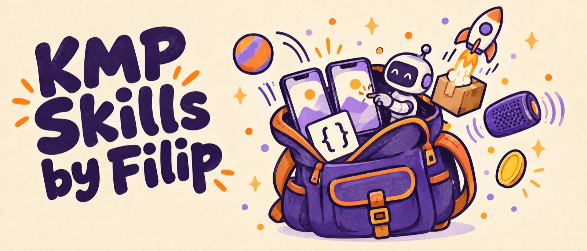
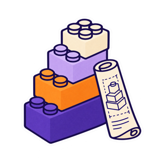
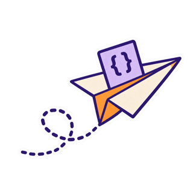
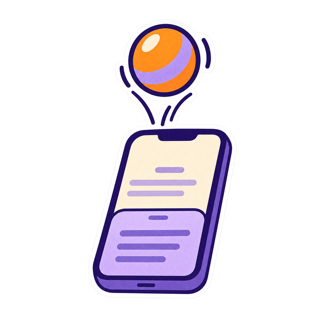
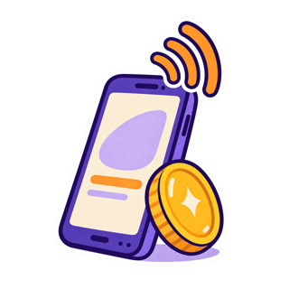
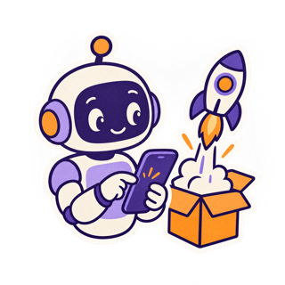
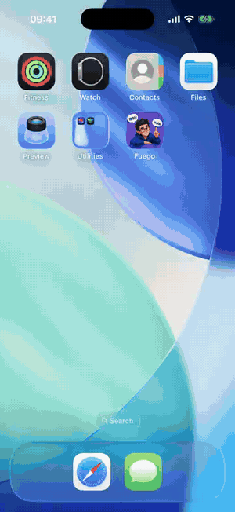
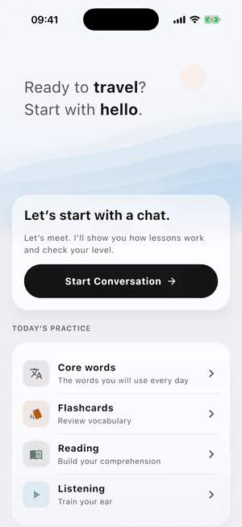
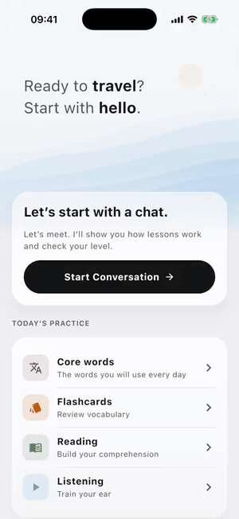

<p align="center">
  
</p>

<p align="center">
  
  
  
  
  
</p>

<p align="center">
  by <b>Filip Kowalski</b> · <a href="https://github.com/filippkowalski">GitHub</a> · <a href="https://x.com/filippkowalski">X</a> · <a href="https://www.filippkowalski.com">Website</a>
</p>

If you build apps for Android and iOS with **Kotlin Multiplatform**, this is for you. It is a set of skills you
give to your AI coding agent (Claude Code, Codex, Cursor and others). Each skill teaches the agent the traps I hit
while shipping real apps: what you see, why it happens, and how to fix it. Your agent then avoids them before it
writes the code, instead of after you lose an afternoon.

## The skills at a glance

###  Foundations

*The things you want in place before the first line of code.*

**[`kmp-app-architecture`](skills/kmp-app-architecture/SKILL.md)**
- **What it's for:** setting up the parts of your app that hold state and talk to Android and iOS.
- **How it helps:** it stops the sneaky bugs that show up months later. A screen that shows the previous user's
  data after a quick account switch. A database or SDK that gets created twice. A deep link that arrives before
  your app is ready and simply disappears.

**[`kmp-testing-strategy`](skills/kmp-testing-strategy/SKILL.md)**
- **What it's for:** writing tests in shared code that run on both Android and iOS.
- **How it helps:** your tests can pass on your laptop and still be broken on iOS. It shows the few things that
  cause that, like a comma in a test name that the iOS compiler refuses, so green really means green everywhere.

**[`kmp-compose-upgrade`](skills/kmp-compose-upgrade/SKILL.md)**
- **What it's for:** upgrading Compose Multiplatform, Kotlin, the Android Gradle Plugin or kotlinx-datetime.
- **How it helps:** it tells you what breaks before you bump anything, and gives you a set of versions that
  already work together in a shipped app.

###  Data and networking

*Where bytes cross the wire, and sometimes fall off.*

**[`kmp-ktor-networking`](skills/kmp-ktor-networking/SKILL.md)**
- **What it's for:** talking to your server with Ktor on Android and iOS.
- **How it helps:** it knows why a slow request dies after exactly 10 seconds on Android but works fine on iPhone,
  why a header meant for your own server can end up on another host after a redirect, and why a quick
  `runCatching` can keep work running after the user already left the screen.

**[`kmp-api-contracts`](skills/kmp-api-contracts/SKILL.md)**
- **What it's for:** turning your server's JSON into Kotlin classes, written by hand or generated from OpenAPI.
- **How it helps:** when your backend adds one new value, older versions of the app often fail to load the whole
  screen. This shows how to make the app shrug and carry on, and how to keep generated models in sync.

**[`kmp-strings-localization`](skills/kmp-strings-localization/SKILL.md)**
- **What it's for:** text and translations with Compose resources.
- **How it helps:** it catches an Android cold start that freezes because of how one string was loaded, push
  notifications that show a raw key instead of text, and plurals or dates that read wrong in other languages.

###  UI and motion

*Sheets that jitter, keyboards that push, balls that should bounce and do not.*

**[`kmp-compose-motion`](skills/kmp-compose-motion/SKILL.md)**
- **What it's for:** animations, gestures and the little press effects that make an app feel good.
- **How it helps:** your animations stay smooth, can be interrupted halfway, and behave the same on Android and
  iPhone, also when someone turns on Reduce Motion.

**[`kmp-sheets-keyboard`](skills/kmp-sheets-keyboard/SKILL.md)**
- **What it's for:** bottom sheets, text fields, the keyboard and the back button.
- **How it helps:** no more sheets that wobble and never settle, keyboards that cover the field you are typing
  in, or text fields that refuse to take focus on iPhone.

**[`kmp-compose-visuals`](skills/kmp-compose-visuals/SKILL.md)**
- **What it's for:** the launch screen, custom shaders, haptics, images and app icons.
- **How it helps:** the splash screen hands over to your app without a flash, images update when the picture
  behind a URL changes, taps give the right little buzz, and status bar icons stay readable.

**[`design-iterate`](skills/design-iterate/SKILL.md)**
- **What it's for:** polishing a screen until it looks right, on any platform.
- **How it helps:** your agent takes a screenshot, looks at it, fixes what is off and checks again, instead of
  guessing from the code.

> **From Filip:** this one polished a lot of my UI. Agents need a feedback loop, and this is a powerful way to
> make them run one. Watch your tokens, though: every round costs a screenshot and a review.

###  iOS, native and payments

*Where Kotlin meets Swift, speakers and money.*

**[`kmp-ios-build`](skills/kmp-ios-build/SKILL.md)**
- **What it's for:** the iOS side of the app: the Xcode project, the bridge to Swift and builds on CI.
- **How it helps:** it saves you the long evenings. Tests that will not link while the app builds fine. Swift
  callbacks that never reach Kotlin, with no error. App Store uploads rejected because of one setting. An app
  that still remembers a user after they deleted it.

**[`kmp-streaming-audio`](skills/kmp-streaming-audio/SKILL.md)**
- **What it's for:** recording or playing raw audio, like voice notes, calls or dictation.
- **How it helps:** the last words of what you play stop getting cut off, and your iPhone app stops crashing in
  a way that Kotlin cannot catch.

**[`kmp-revenuecat`](skills/kmp-revenuecat/SKILL.md)**
- **What it's for:** selling subscriptions or purchases through RevenueCat.
- **How it helps:** your products show up on both stores, a restore really unlocks what the user paid for, and
  you only promise a free trial to people who can actually get one.

###  Testing with agents and shipping

*Let a robot tap the buttons, then ship the same app to two stores.*

**[`kmp-agent-device-testing`](skills/kmp-agent-device-testing/SKILL.md)**
- **What it's for:** letting your AI agent tap through your app on a simulator or a phone.
- **How it helps:** one set of test tags works on both iOS and Android, so the agent finds every button, even
  inside sheets and dialogs, and checks its own work on a real screen.

**[`kmp-store-release`](skills/kmp-store-release/SKILL.md)**
- **What it's for:** shipping the same app to the App Store and Google Play.
- **How it helps:** your release really reaches review instead of waiting quietly in the console, version
  numbers follow each store's rules, and your signing keys stay safe.

## Install

**Claude Code:** run these two commands inside Claude Code.

```text
/plugin marketplace add filippkowalski/kmp-skills-by-filip
/plugin install kmp-skills-by-filip@kmp-skills-by-filip
```

**Codex, Cursor, Gemini CLI and other agents:** one command, and it asks where to put the skills. You need
Node.js 22.20 or newer.

```bash
npx skills@latest add filippkowalski/kmp-skills-by-filip
```

**By hand:** copy the skill folders into your skills folder.

```bash
git clone https://github.com/filippkowalski/kmp-skills-by-filip.git
cp -R kmp-skills-by-filip/skills/* ~/.claude/skills/
```

That is it. There are no API keys or settings. Your agent picks the right skill by itself when your task needs
it. Two skills run tools on your machine, so install these if you want them:

| Skill | Needs |
|---|---|
| `kmp-agent-device-testing` | Xcode with an iOS Simulator, [AXe](https://github.com/cameroncooke/AXe) (`brew install cameroncooke/axe/axe`), Android platform-tools (`adb`) |
| `kmp-ios-build` | Xcode, and `brew install xcodegen` if your project uses XcodeGen |

## I recommend adding these too

These are official skills from the companies behind the tools. They cover their own libraries really well, and
this pack covers the traps between them. Together they cover most of a KMP app.

| Skills | What you get | Install in Claude Code |
|---|---|---|
| [Kotlin/kotlin-agent-skills](https://github.com/Kotlin/kotlin-agent-skills) (JetBrains) | Help with the AGP 9 migration, moving from CocoaPods to Swift Package Manager, and faster iOS builds | `/plugin marketplace add Kotlin/kotlin-agent-skills`<br>`/plugin install kotlin-agent-skills@Kotlin` |
| [android/skills](https://github.com/android/skills) (Google) | The Android side done right: edge-to-edge, back navigation, Navigation 3, test setup and Play policy | `/plugin marketplace add android/skills`<br>`/plugin install android-skills@android-skills` |
| [RevenueCat/ai-toolkit](https://github.com/RevenueCat/ai-toolkit) (RevenueCat) | The official way to set up RevenueCat, with notes for KMP | `/plugin marketplace add RevenueCat/ai-toolkit`<br>`/plugin install revenuecat@RevenueCat` |
| [firebase/agent-skills](https://github.com/firebase/agent-skills) (Firebase) | Setting up Firebase and its services | `/plugin marketplace add firebase/agent-skills`<br>`/plugin install firebase@firebase` |
| [emilkowalski/skills](https://github.com/emilkowalski/skills) (Emil Kowalski) | A great eye for motion and UI polish | `npx skills@latest add emilkowalski/skills` |

For other agents, `npx skills@latest add <owner/repo>` installs any of them.

## A note from Filip

I was looking for a way to contribute to the Kotlin community. A few years ago I would have written a library.
Today I believe libraries are not as necessary as they were. An AI agent can write almost any code you ask for.
What it does not know are the traps: the API that looks fine and fails on one platform, the default that cuts
your requests at ten seconds, the setting that silently stops your animations.

Over the last few years I collected those traps from Twitter and other platforms, and I refined them through
my own work, shipping apps with Kotlin Multiplatform on both stores. I think they can help a lot of people who
like to build with Kotlin.

If a skill saves you an afternoon, that is the contribution I hoped to make.

## Built with these skills

These animations come from an app I built with Kotlin Multiplatform and Compose Multiplatform. One codebase
ships to the App Store and Google Play.

| Launch hand-off | One shader, two runtimes | Spoken-sentence highlight | Rubber-band overscroll |
|:---:|:---:|:---:|:---:|
|  |  |  |  |

The motion ideas come from [Emil Kowalski's skills](https://github.com/emilkowalski/skills), which helped me a
lot while I built these. An unchanged copy of the seven I used is in
[`third-party/emilkowalski-skills`](third-party/emilkowalski-skills), with his MIT license. Install his skills
from his repo to get the latest version. Emil does not endorse this repo.

## Versions

The rules were checked on Kotlin 2.1 to 2.4, Compose Multiplatform 1.7 to 1.11, AGP 8.7 to 8.13, Ktor 3.0 to 3.1,
kotlinx.serialization 1.7, Coil 3.5, purchases-kmp 3.5, Android API 26 to 36, and iOS 18 and 26. Each rule
lists the exact versions. If one stops being true, please open an issue.

## Contributing

Found a trap that belongs here? Issues and pull requests are welcome. A good rule comes from a library, the
platform, a build tool or a store (not one app's choice), has a fix that works in any app, and says what you
see, why it happens, how to fix it and on which versions.

## License

[MIT](LICENSE) © 2026 Filip Kowalski. Files in `third-party/` keep their own licenses.
